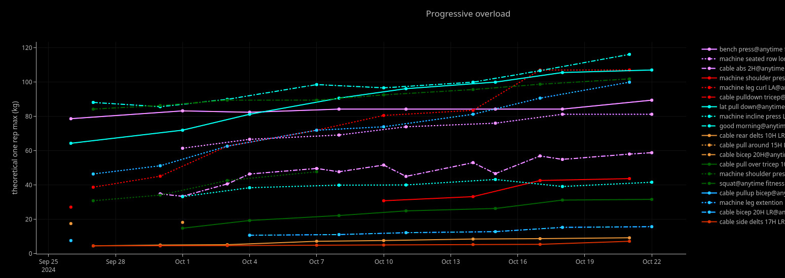
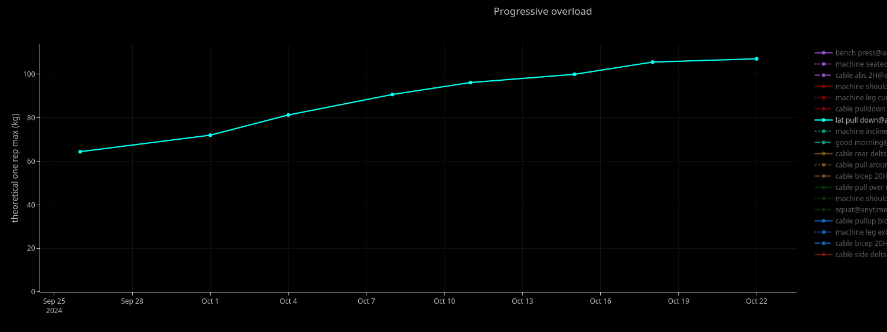
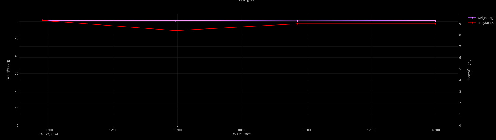

# What is it?

This tool can track your progressive overload and weight using local databases and lets you view them in an interactive graph in your browser.

## Images




# Quickstart

```bash
$ git clone https://github.com/shinjitumala/gym.git
$ cd gym
$ cat ./install.sh
...
$ ./install.sh
$ echo '{"db": "<path to your database file>"}' > ~/.config/gym.json
$ sqlite3 "<path to your database file" < up.sql
```

# Prerequisites
- rust
- sqlite3

# Examples
## Add a place
```bash
$ gym place --name "my personal gym" --desc "Near my house at foo."
```
## Add data

```bash
$ cat 2024-10-24.csv
bench press,30x8,50x4,72.5x8x4x2
lat pull down,75x13x6x4
...
$ gym add --data 2024-10-24.csv
# Follow the prompt
...
```

## Generate graphs

### Manually generating graphs (optional)
Usually, the data gets updated when you add new data using the `gym add` command.
You can manually generate them using the following if necessary.

```bash
$ gym upd
```
### Viewing the graph
Open `s/index.html` with a browser of your choise.

```bash
vivaldi s/index.html
```
