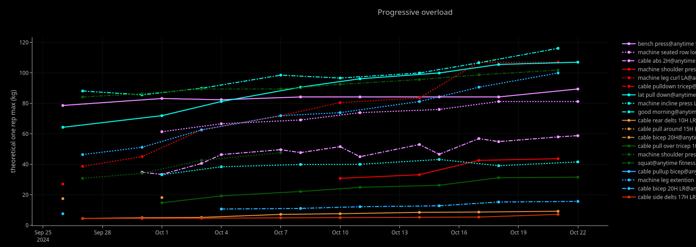
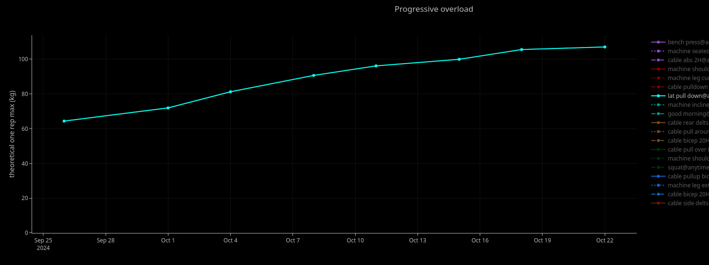
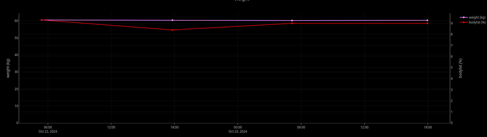

# gym

A local-first fitness tracker for progressive overload, body weight and food.
It records your training sets, weigh-ins and meals in plain-text [TOML][toml]
files on your machine, with no server and no account.





[toml]: https://toml.io

## Install

Builds and installs the `gym` binary into `$CARGO_HOME/bin` (default
`~/.cargo/bin`).

Prerequisites: `cargo` (Rust), `jq`, `rsync`, and `git` (used by `gym sync`).

```bash
$ git clone https://github.com/shinjitumala/gym.git
$ cd gym
$ ./install.sh
```

`install.sh` runs `cargo fmt`, builds with `cargo build --release --locked`,
resolves the target directory via `cargo metadata` (so a relocated
`CARGO_TARGET_DIR` is honored), and `rsync -ruP`s `target/release/gym` into
`$CARGO_HOME/bin` using a temp file plus an atomic `mv -f` rename. It is
idempotent and safe to run while `gym` is already running.

## Configuration

Create `~/.config/gym.json` (or point `$CONFIG_PATH` at a file):

```json
{
  "db": "/home/me/g/gym_data/d",
  "repo": "/home/me/g/gym_data"
}
```

| Field  | Meaning                                                                 |
|--------|-------------------------------------------------------------------------|
| `db`   | Directory holding the TOML database. Must already exist.                 |
| `repo` | Git repository used by `gym sync`. Must already exist.                   |

The database is a set of TOML files under `db`: `exercise.toml`,
`muscle_group.toml`, `place.toml`, `food.toml`, and the entry directories
`set/`, `session/`, `weight/` and `meal/` (sharded per day or per month).

## Usage

### `gym weight` — record a weigh-in

Prompts for the date, weight (kg), bodyfat (%) and a note, then saves.

```bash
$ gym weight
```

### `gym new` — log a training session

Pick a place and time, then add exercises and their sets (load × reps). Recent
history for the chosen exercise is printed so you can beat your last session.
Press ESC to finish an exercise or the session.

```bash
$ gym new
```

### `gym food` — log meals

Shows today's running totals, lets you pick a food (or register a new one),
and records an amount multiplier per meal.

```bash
$ gym food
```

### `gym sync` — sync the data repository

Pulls the `repo`, commits any changes and pushes to its remotes.

```bash
$ gym sync
```

### `gym web` — web server

Not implemented yet: the handler is a `todo!()`, so this command panics.
Graphing currently means reading the TOML database directly.

## Deploy to Android

`deploy.sh` cross-compiles a release binary for `aarch64-linux-android` with
the Android NDK toolchain.

```bash
$ ./deploy.sh
```

## License

Proprietary. See [LICENSE](LICENSE).
